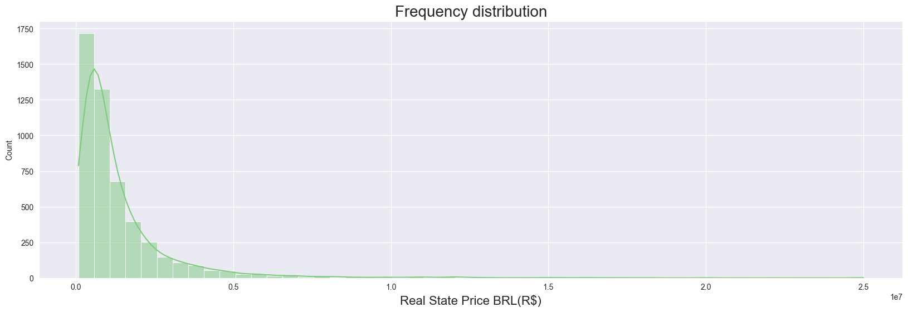

<h1 align="center">Real State Price Prediction</h1>
<h3 align="center">A linear regression problem.</h3>

  We all know that <strong> planning is the core of any succesful business </strong> . Concerned about dealing with a high demand of new Real State for sale, the CEO of a Real State Comapany asked for a preditive algorithm that based on the historical data provided by him, could estimate the price of a real state.
 
 
The first thing I did, was to check the data provided by the company and all the variables. After importing it to my notebook, I found out that I was dealing with a <strong>5000 rows by 4 Columns dataset</strong> and the variables were the following:
  <ul>
    <li> Price
    <li> Area
    <li> Distance from the beach 
    <li> Distance from the drugstore
  </ul>  
 
The CEO asked for a price prediction so, since the beggining I knew that <strong>my dependent variable was the Price</strong>, the next step was to find the best independent variables to explain the phenomena. Before starting, I quicly checked the frequency distribution of the Real State prices and saw somethin like this:
 

 
I had three possible variables, so, to undesrtand better the bahavior of each variable I decided to do a Pairplot using the Seaborn Python library. The results were the following.

  <ul>
    <li> Area
    <li> Distance from the beach
  </ul>
  

<h3 align="left">Connect with me on LinkedIn:</h3>

<h3 align="left">Languages and Tools used in this project:</h3>

      

